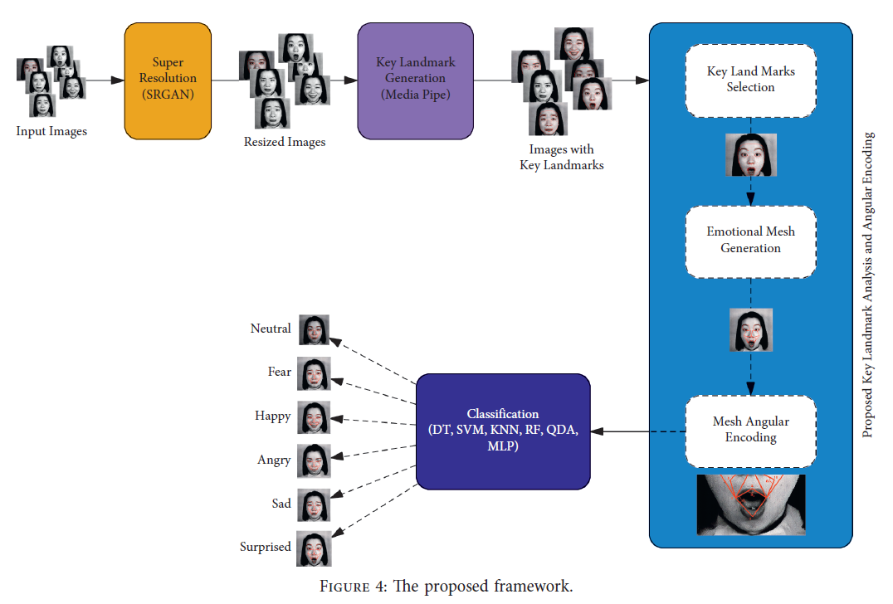
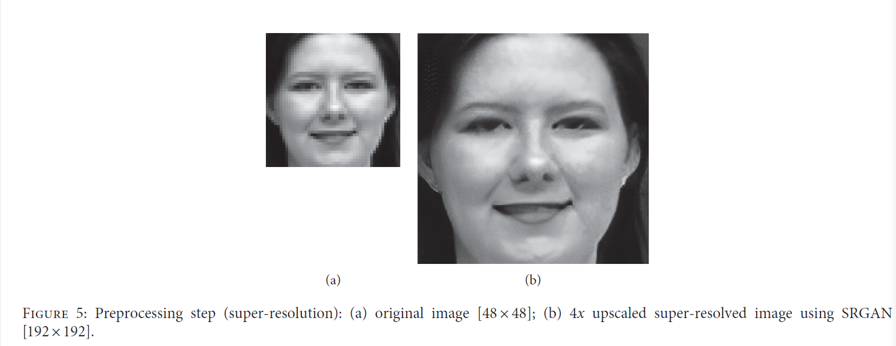
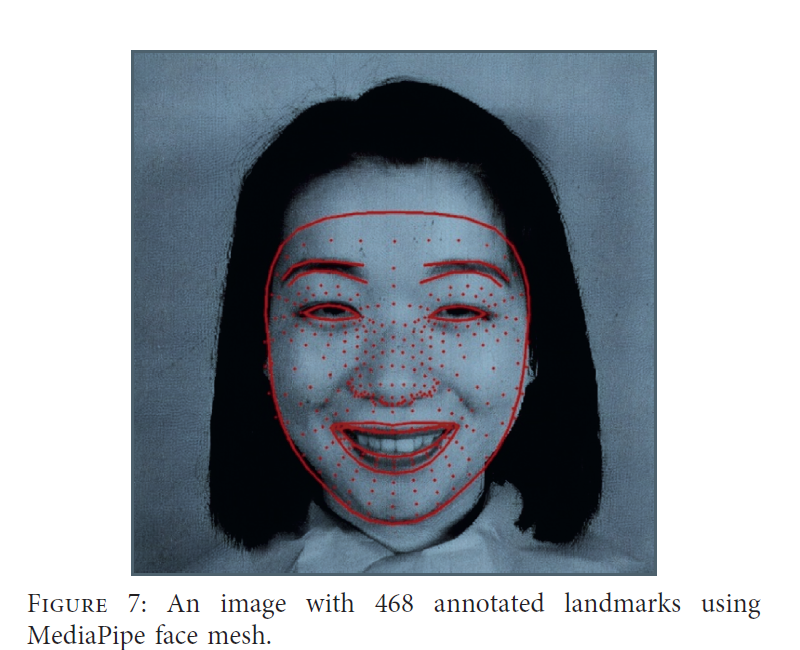
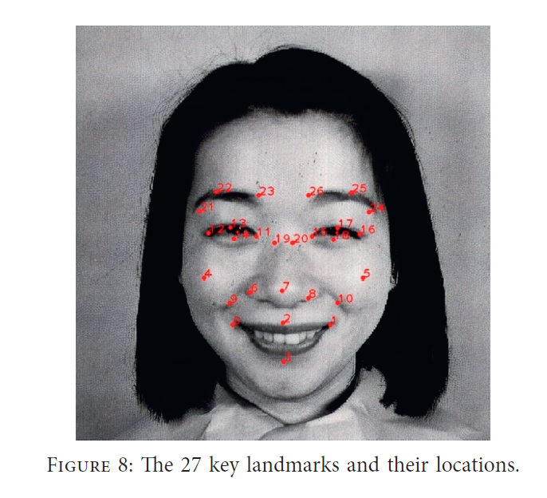
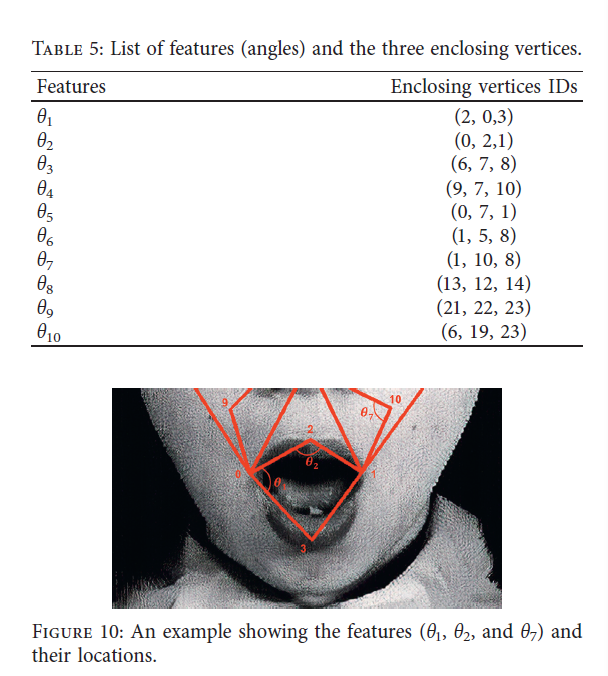
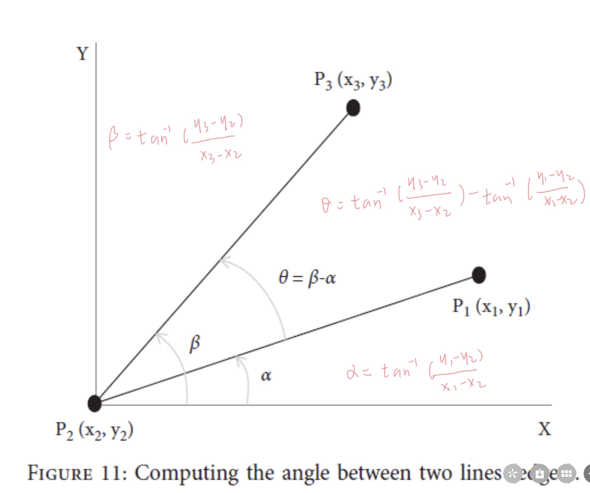
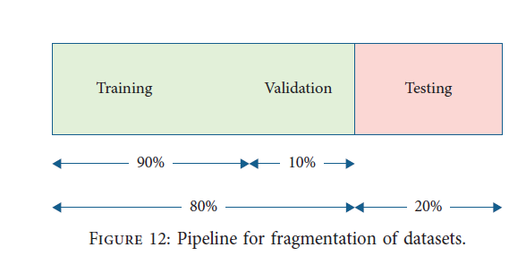
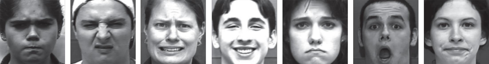
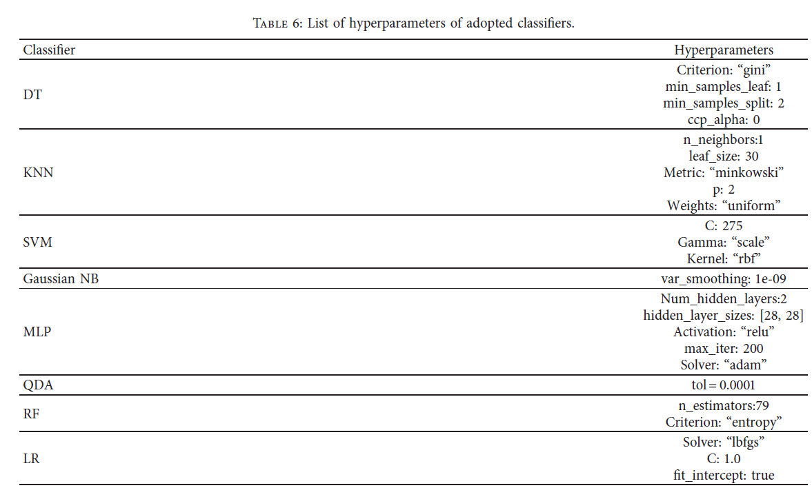
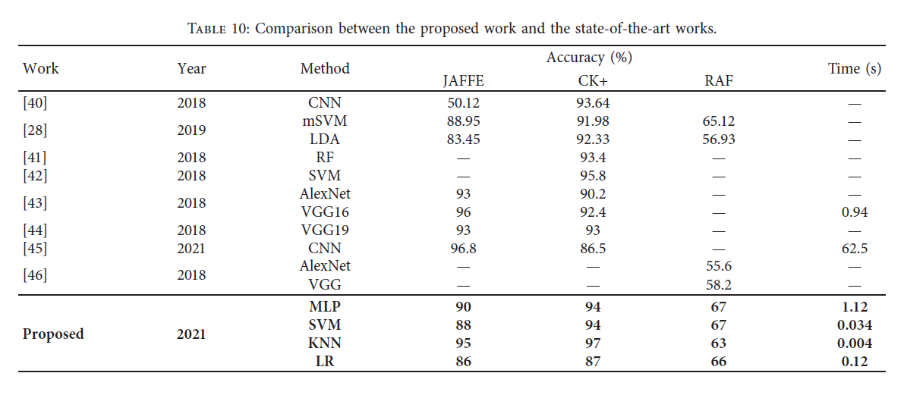

##论文阅读笔记

#### 一. 题目
**Deploying Machine Learning Techniques for Human Emotion Detection**

#### 二. 内容概述
##### 2.1 研究背景
  - **研究领域**
++Computational Intelligence & Neuroscience & Emotion recognition&HumanRobot Interaction (**HRI**)++
运用机器学习算法实现人类情绪的自动化识别。
  - **相关工作**
**1.模型框架**
*  基于条件生成对抗性网络（基于CGAN）的框架、
> 一个生成器G（generator）和三个鉴别器（discriminator）构成了这种体系结构。任何查询人脸图像都被转换成具有由生成器G保留的某些因子的原型人脸表情形式，准确率为81.83%。
> **论文**：Deng J ,  Pang G ,  Zhang Z , et al. **CGAN Based Facial Expression Recognition for Human-Robot Interaction**[J]. IEEE Access, 2019, PP(99):1-1.
*  CNN模型(卷积神经网络)、
> CNN被设计用于微笑检测、情感识别和性别分类。为是一个多任务模型，其准确率为71.03%。
> **论文**：Sang D V, Cuong L T B, Van Thieu V. **Multi-task learning for smile detection, emotion recognition and gender classification**[C] // Proceedings of the Eighth International Symposium on Information and Communication Technology. 2017: 340-347.
*  深度学习（deep learning）
> * 深度CNN来部署面部表情识别系统。该系统可以自动提取面部表情的特征，从而实现自动识别。此外，它还包括输入、预处理、识别和输出模块。它还用于模拟和评估在网络结构、学习速率和预处理等方面对**日本女性面部表情（JAFFE）数据集**和扩展的**Cohn-Kanade（CK+）数据集**的识别性能，对于JAFFE和CK+数据集，性能精度分别为76.7442%和80.303%。
> * SVM、LBPS(local binary patterns) 
> * **相关论文**：Shan K, Guo J, You W, et al. **Automatic facial expression recognition based on a deep convolutional-neural-network structure**[C]//2017 IEEE 15th International Conference on Software Engineering Research, Management and Applications (SERA). IEEE, 2017: 123-128.
> **3D facial expression recognition using SIFT descriptors of automatically detected keypoints**

 **2.研究趋势**
* 用于**视频流情感检测**的混合深度学习模型
> 一种用于视频情感检测的混合深度学习模型。空间CNN用于处理静态面部图像，时间CNN用于光流图像。这两个处理分支分别用于学习视频片段的高级空间和时间特征，准确率为75.39%。
> 对于基于视频的面部表情识别，他们发现将**空间**和**时间**信息结合在一起更有效。使用**CNN和LSTM**集成视频中的时空信息框架的准确率达到65.72%。
> **论文**：Zhang S, Pan X, Cui Y, et al. **Learning affective video features for facial expression recognition via hybrid deep learning**[J]. IEEE Access, 2019, 7: 32297-32304.
> Pan X, Ying G, Chen G, et al.** A deep spatial and temporal aggregation framework for video-based facial expression recognition**[J]. IEEE Access, 2019, 7: 48807-48815.

  - **待解决的问题**
作者主要描述了之前关于人脸情绪识别中使用的模型，其使用的算法以及准确率，但并未对这些模型的优缺点进行总结。

##### 2.2 问题提出
  - **研究切入点**
  本文提出了一种基于深度和机器学习技术的情感检测方法。这种方法的主要思想是使用MediaPipe生成人脸的网络，由点和边构成，之后将生成的关键点编码为一组可区分的特征。最后，在提取的特征上使用机器学习算法实现情绪的分类。
  - **研究问题**
  运用机器学习算法实现人类情绪的分类任务。

##### 2.3 研究设计
  - **整体框架**
  
  
  **Super Resolution**:首先，对图像进行预处理，使用SRGAN执行超分辨率任务。得到调整后的图片，将图像裁剪，聚焦在个体的脸部。
  **Key Landmark Gerneration**：使用MediaPipe在人脸图像上生成关键标志。
  **A key landmark analysis and an angular encoding module**：该模块包括关键点选择、情感网格生成、网格角度编码，目的是**生成连接选定关键点的情感网格**，将获得的网格编码为角度值以生成特征图。
  **Classification**：将生成的特征图使用分类器将生成的特征图划分为六个情绪类别。
  - **模块细节**
   -  **Super Resolution**
>    **目的：** 清晰展现人脸图像的边界并且识别关键点，为后续人脸图像几何特征的提取做准备。
   **使用技术**：**SRGAN**,一种用于图像超分辨率（SR）的生成性对抗网络（GAN），图像以4倍放大因子进行超分辨率，同时最小化超分辨率图像和原始图像之间的均方误差（MSE），并最大化峰值信噪比（PSNR）。下图为效果展示：
   
   -  **Key Landmark Gerneration**
>    **目的**：实现人脸关键点的标注。
>    **使用技术**： **MidiaPipe**。一个开源的ML框架，由Google开发，致力于构建真实的计算机视觉应用程序。前使用MediaPipe实现的解决方案包括人脸检测、人脸网格注释、虹膜定位、手部检测、姿势估计、头发分割、对象检测和跟踪以及三维对象检测（Objectron）。人脸网格实时计算468个3D人脸界标,如下图所示：
>    

   -   **A key landmark analysis and an angular encoding module**
>    **目的**：生成情感网格。将选定的关键点连接形成网络，再将其编码为角度值以生成特征图。
>    **Key Landmark Selection（关键点选择）**：在该模型中，从468个检测到的点中仅选择了27个关键点。这些关键点将用于定义情感面部网格的顶点。关键点的选择基于FACS（Facical Action Coding System），该系统对单个面部肌肉的运动进行编码，它可以用来描述面部动作，这些动作构成基于面部肌肉变化的表情。还定义了AU，动作单元，是指特定面部肌肉的运动，不同AU的组合对应不同的情绪。
>    
>    **Emotional Mesh Generation（面部情感网络的生成）**：绘制面部情感网格的边，定义顶点之间的连接，以建立闭合网格结构。最后产生了27个顶点和38条边。**面部情感网格边之间角度的偏差反映了面部肌肉的收缩和松弛**，将用于识别面部情感。
>    **Mesh Angular Encoding（面部角度的编码）**：提取十个特征，定义面部情感网格特定边缘之间的角度。角度以度表示，范围为（0°、360°）。然后将这些特征输入到ML分类器，从中学习以识别每种情感。下图为提取的十个特征以及这些特征在人脸上的示例,以及如何计算两条边之间的角度：
>    
>    
   -   **Classification**
>    **目的**：使用不同的机器学习分类算法对图片进行情绪分类，特征值为面部情感网格特定边缘之间的角度。
>    将数据划分为训练集和测试集，划分比例如下：
>    
>    最后采用10倍交叉验证来估计模型最优超参数组合，以避免过度拟合。

  - **数据**
   - **Cohn–Kanade（CK+）**
   CK+数据集由123名参与者的593个视频序列组成。每个序列包含从开始（中性帧）到峰值表达式（最后一帧）的图像。从峰值表达式中描绘了与每个序列相关联的标签。该数据集包含七种不同表情的图像：**愤怒、蔑视、恐惧、厌恶、幸福、惊讶和悲伤**。图像的分辨率为640×480像素。在本文研究中，图像被裁剪成48×48像素，以聚焦在个体脸上。下图显示了每个表达式的示例图像：
   
   - **日本女性面部表情（JAFFE）**
   JAFFE数据集有213张10位不同女性演员的照片，照片中有7种不同的面部表情。有六种主要表达方式：**快乐、悲伤、惊讶、愤怒、厌恶和恐惧**，外加一种中性表达方式。图像的分辨率为256×256像素。下图显示了每个表情的示例图像：
   
   - **真实世界情感人脸数据库（RAF-DB）**
   RAF-DB包含15339张面部图像，其中包含来自数千名不同年龄和种族的人的不受控制的姿势和照明。RAF-DB中的图像由大约40个注释器标记。数据库包括六个基本表达式和一个中性表达式。RAF-DB的样本图像如下图所示：
   

##### 2.4 数据分析
  - 模型的评估
   - 使用以下八种机器学习分类算法对于本文提出的面部情绪识别模型进行性能评估：
    
  - 机器学习分类器评估方法
    - 准确度（accuracy）
    - 精确度（precision）
    - 召回率（recall）
    - F1分数（f1-score）
    - 训练时间（training time）
    - 学习曲线（learning curve）
    - 混淆矩阵（confusion matrix）

##### 2.5 结论与讨论
  - **研究结论**
    - 该方法在人类情感检测中具有很高的性能，所提出的编码模块与分类器（包括KNN、SVM和MLP）具有优异的性能。
    - 和该领域所提出的其他技术相比，该方法具有优异的性能。
   
 
  - **解决问题**
    - 在解决面部情绪识别问题中，通过选择面部关键点形成面部情绪网络，进而对于网络角度的变化进行编码，**实现了面部特征的低维提取**，在本文中，作者提取了十个特征值，使得基于ML的方法能够在短时间内达到最佳性能，并且计算成本比基于DL的方法低得多。
    - 同时保证了模型的准确率。

#### 三	. 内容概述
 - **耳目一新的点**
   - “面部情感网格边之间角度的偏差反映了面部肌肉的收缩和松弛”,通过这一直观明了的现实现象制定了表达情绪的特征——角度。从这一角度思考带给自己很清晰明了的感觉。
 - **值得学习的东西**
   - 面部角度的编码，思考的角度。现实生活中，人们表现出不同的表情时，面部肌肉的松弛程度也不同，我感觉这篇文章作者的切入点就是通过面部不同肌肉的松弛程度来对不同的表情进行分类，进而把肌肉的松弛程度使用面部情绪网络中边与边之间的角度来进行量化。
   - 整体的模型设计，逻辑清晰。
   - 机器学习模型的评估方法。
 - **感兴趣，以后想做的东西**
   - 作者在文中提到:
>    In human interaction, 7% of the affective information is conveyed by words, 38% is conveyed by speech tone, and 55% is conveyed by facial expressions.
>    在人类互动中，7%的情感信息是通过文字传达的，38%是通过语调传达的，55%是通过面部表情传达的。

     所以我对将面部表情与语调结合起来的实时或者视频流中情绪识别研究很感兴趣。作者也提到：
>    Such information obtained through emotion analysis is useful in monitoring of the overall mood of a group of persons to identify any destructive events.

    例如那些无差别杀人，如果可以提前从人物的表情、情绪、行动觉察到，就能避免重要事故发生。其他应用场景再思考一下。

 - **存在疑惑的地方**
  - 关于面部情感网格的37条边的确定，作者并没有给出理论基础来解释为什么这样选择。如果给出更加清楚的定义就好了。
